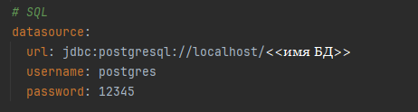
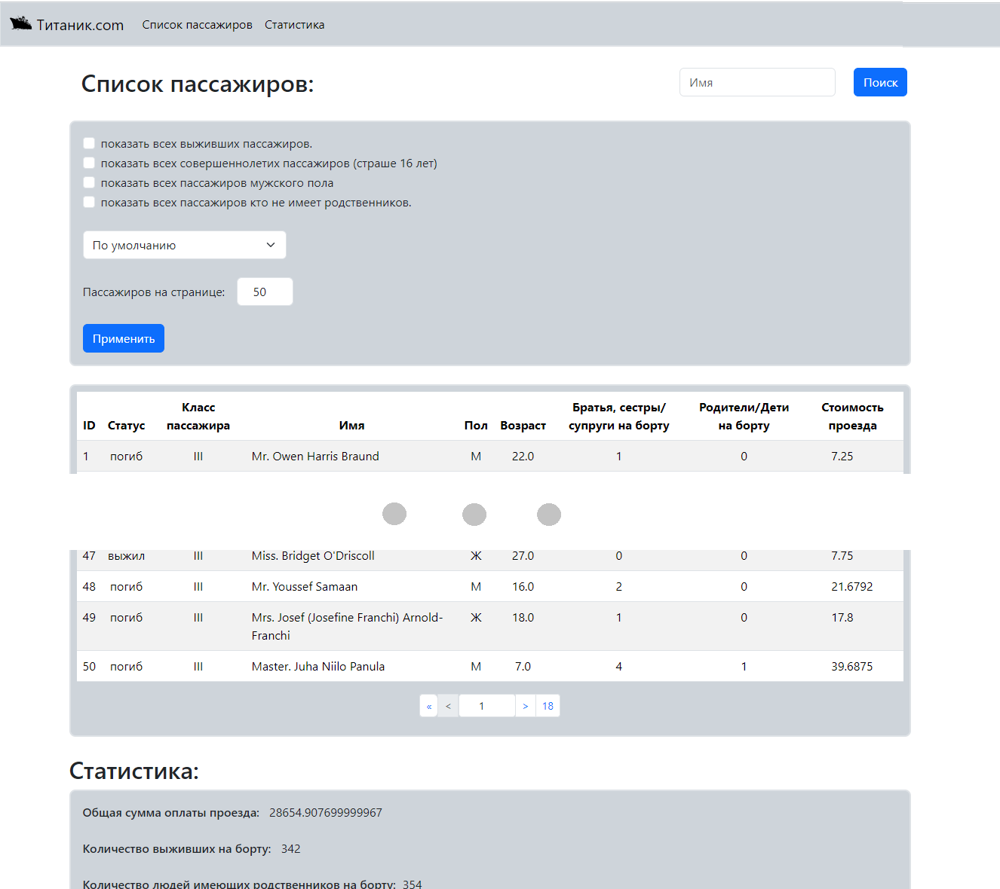
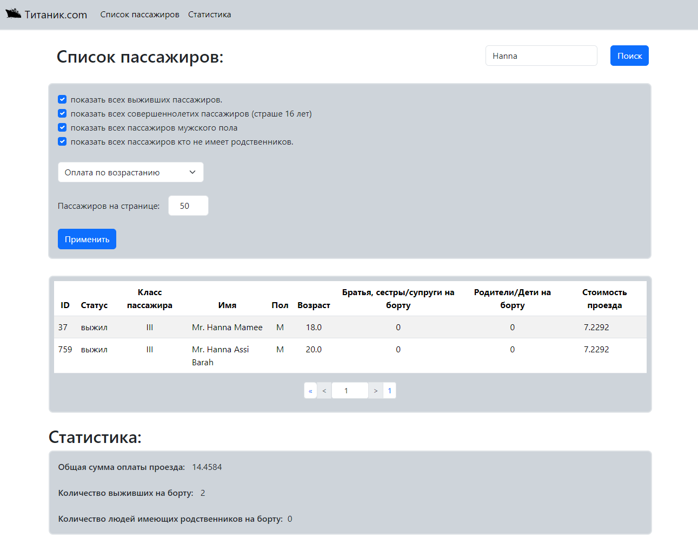
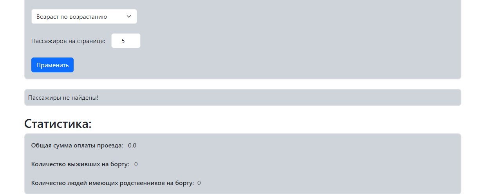

# Titanic

### _Тестовое задание_

[Текст задания](https://sites.google.com/iteratia.com/java-test-titanic/).

**Старт:** 18.07.2024 18:30 МСК

**Крайний срок:** 25.07.2027

**<details><summary>Запросы</summary>**

```java
Главная страница

http://localhost:8080
```

**`GET`**
> **/** - вывести пассажиров в соответствии с фильтрами

*Входящие параметры:*

**`searchName`** - имя по которому хотите найти пассажира

**`numberPassengersOnPage`** - сколько пассажиров хотите видеть на странице

**`showSurvivesPassengers`** - показать всех выживших пассажиров.

**`showAdultPassengers`** - показать всех совершеннолетних пассажиров (страше 16 лет)

**`showMalePassengers`** - показать всех пассажиров мужского пола

**`showWithoutRelatives`** - показать всех пассажиров кто не имеет родственников

**`sort`** - тип сортировки. Вводится в формате "*<<тип сортировки>> <<параметр>>*". Типа сортировки два: asc и desc.

**`numberPage`** - номер страницы

**Пример:**

> **/?searchName=harris&showSurvivesPassengers=on&numberPassengersOnPage=5&sort=asc age**

Запрос выведет на страницу список выживших пассажиров у которых в имени встречается "Harris" в отсортированном по
возрасту виде.

</details>

**<details><summary>Запуск приложения</summary>**

- Открыть приложение через Idea.

- Прикрепить БД к нашему приложению:
    - Создать в PostgreSql БД <<имя бд>>.
    - Поменять параметры в application.yml:
<p align="center"></p>
- Запустить `TitanicApplication.java.`

</details>

**<details><summary>Скриншоты</summary>**

Стартовая страница
<p align="center"></p>

Запрос
<p align="center"></p>

Не найдено
<p align="center"></p>

</details>

**Стек технологий**

Java 17, Spring JPA, Maven, PostgresSQL, Thymeleaf.